# Week 3 - PDF Password Cracking

## Overview

As part of Week 3 of the Cybersecurity program at Networkwalks (Batch B082), I practiced password recovery against password-protected PDF files using three different approaches.

The activities were divided into three parts:

1. John the Ripper (JTR) and Johnny GUI on Windows
2. Networkwalks Hash Calculator and Password Cracker
3. John the Ripper with AI assistance using Hexstrike-AI MCP and Claude Desktop on Kali Linux

These exercises helped me understand how password-protected PDF files can be converted into crackable hashes and how password-cracking tools can be used in an authorized laboratory environment.

> **Ethical Use:** These techniques were performed only against provided lab files for educational purposes. Password-cracking tools should only be used against files or systems that you own or have explicit authorization to test.

---

# Part 1 - John the Ripper and Johnny on Windows

## Objective

The objective of this exercise was to recover the password of the provided `My Locked PDF1.pdf` file using John the Ripper and the Johnny graphical interface on Windows.

---

## Tools Used

- John the Ripper (JTR)
- Johnny GUI
- Windows PC
- PDF password hash

---

## Step 1 - Install John the Ripper

I downloaded John the Ripper from the official Openwall website and extracted/installed it on the Windows computer.

Official website:

https://www.openwall.com/john/

The `john.exe` executable is located inside the `run` directory of the John the Ripper installation.

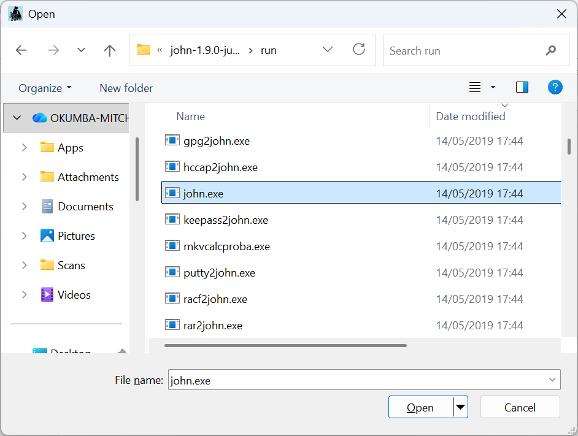

---

## Step 2 - Install Johnny

I installed the Johnny graphical interface for John the Ripper.

Official information:

https://openwall.info/wiki/john/johnny

After installation, I opened Johnny and configured it to use the `john.exe` executable from the John the Ripper `run` directory.

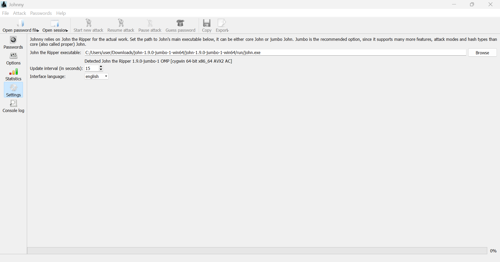

---

## Step 3 - Extract the PDF Hash

The encrypted PDF files were processed using the **Online Hash Crack PDF Hash Extractor** to obtain the password hashes:

https://www.onlinehashcrack.com/tools-pdf-hash-extractor.php/


The resulting hash started with:

```text
$pdf$
```

I copied the complete hashes and saved them in text file respectively named:

```text
hash1.txt
hash2.txt
hash3.txt
```

The hashes were saved without additional characters before $pdf$.

### Screenshots

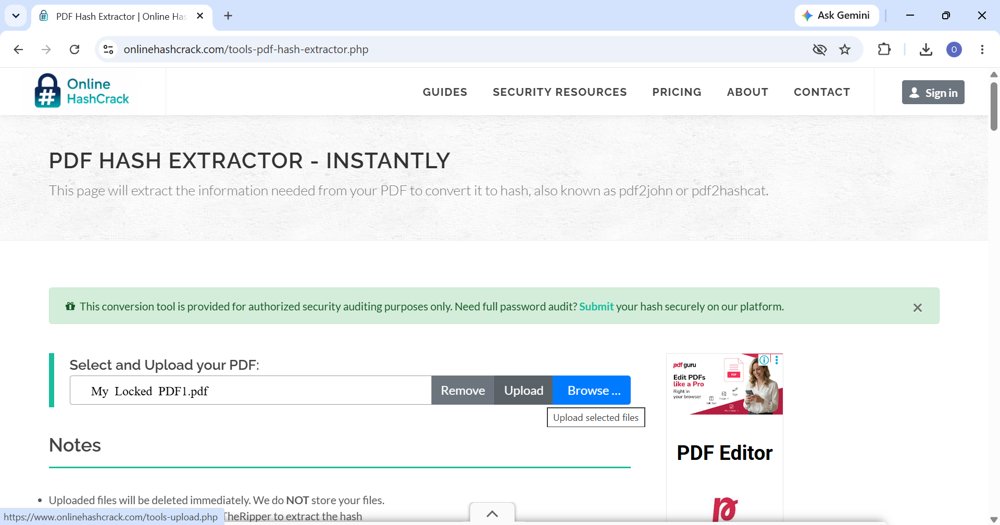

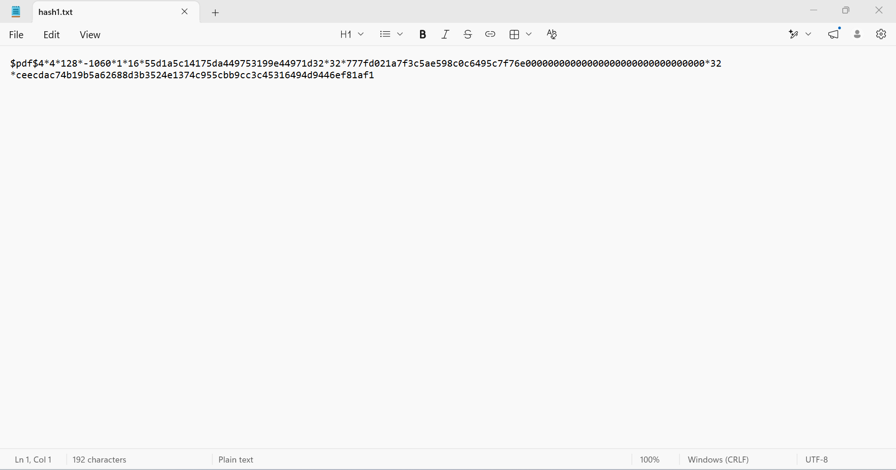

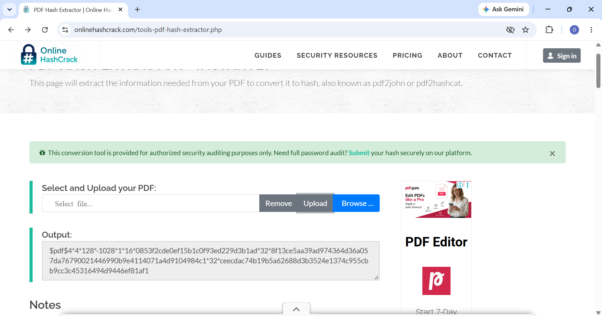

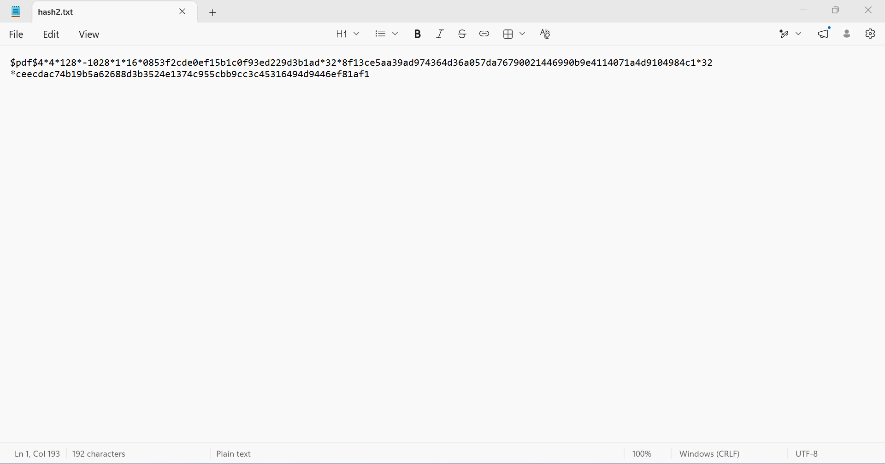

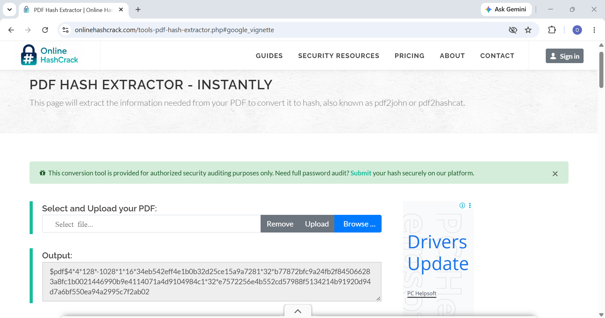

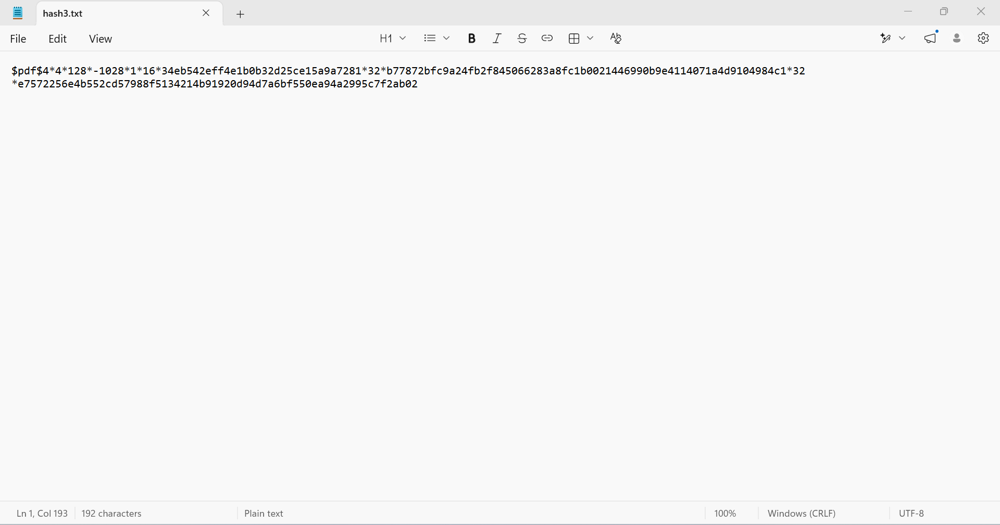

---

## Step 4 - Load the Hashes into Johnny

I opened Johnny and loaded the `hash1.txt` file containing the PDF hash.

### Screenshots

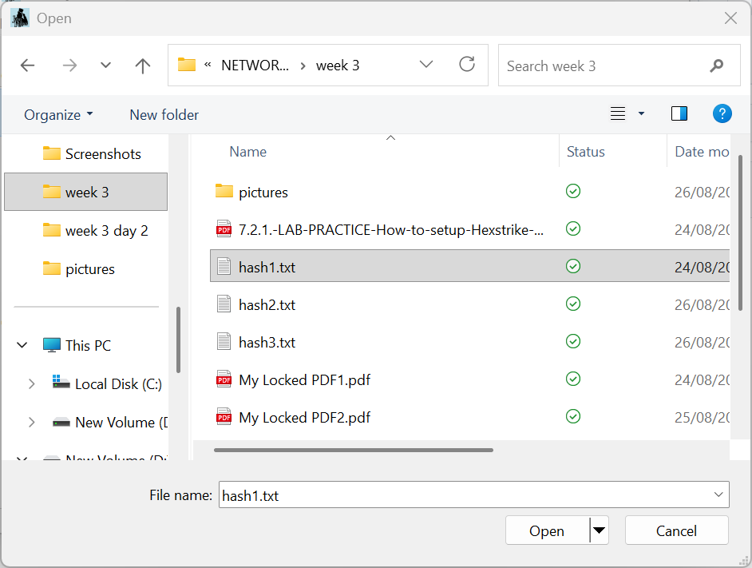

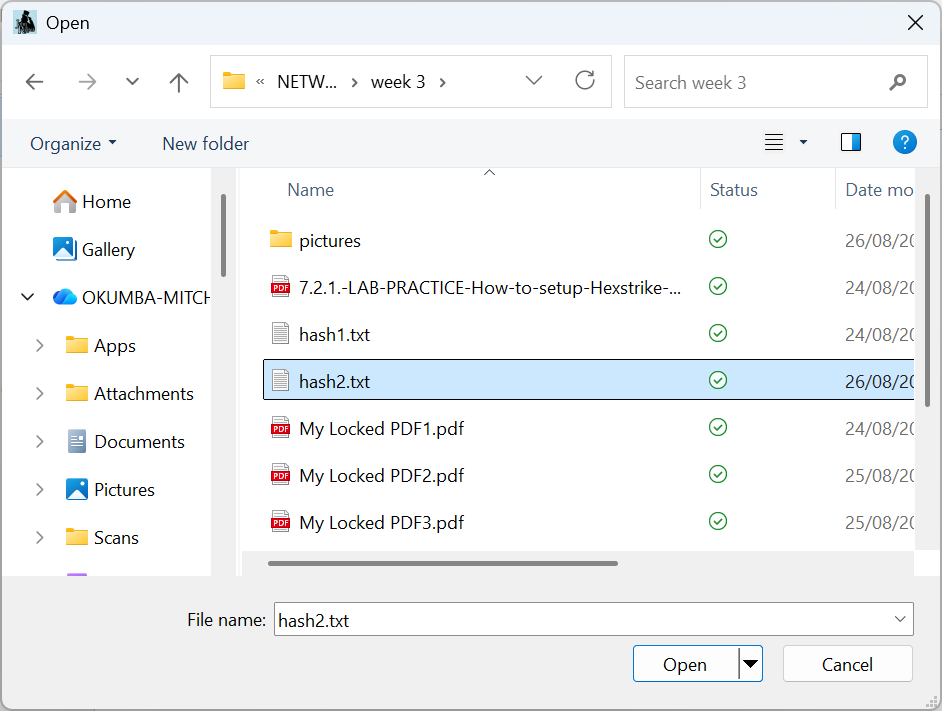

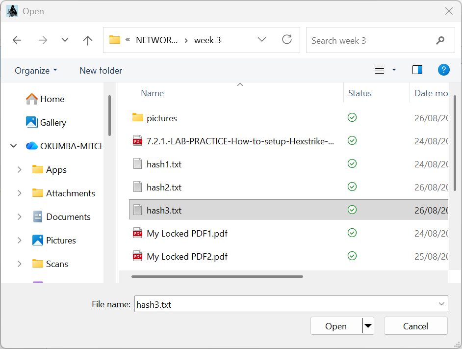

---

## Step 5 - Start the Password Attack

I started a new password-cracking attack using John the Ripper.

### Screenshots


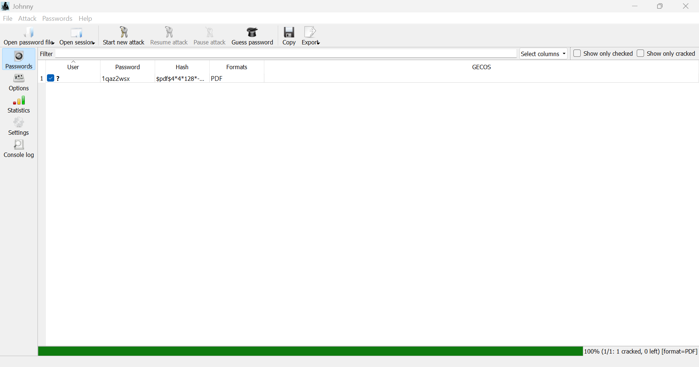

---

## Step 6 - Verify the Password

After obtaining the password, I opened the encrypted PDF and entered the recovered password.

The PDF opened successfully, confirming that the password had been recovered.

### Screenshots

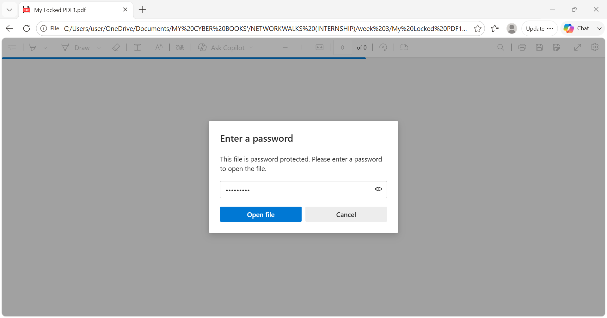

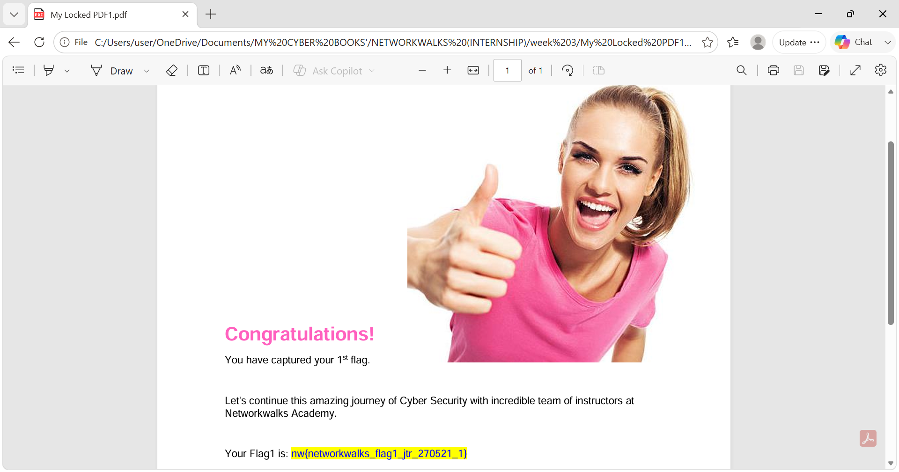

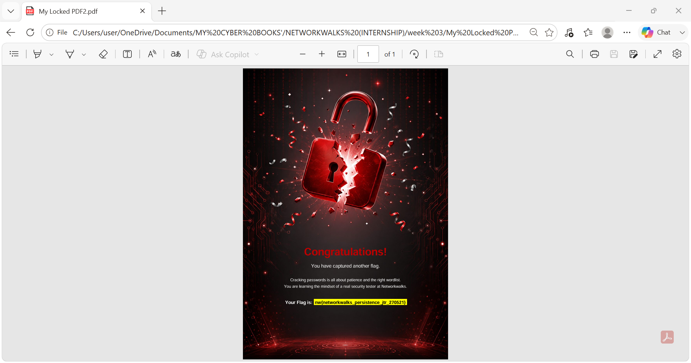

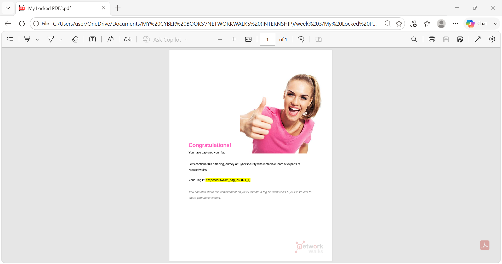

---

# Part 2 - Networkwalks Hash Calculator and Password Cracker

## Objective

The objective of this exercise was to recover the password of the provided PDF using the Networkwalks Hash Calculator and Password Cracker through a web browser.

---

## Tools Used
- Networkwalks Hash Calculator
- Networkwalks Password Cracker
- Web browser
- Kali Linux or Windows

  ---
  
## Step 1 - Obtain the Lab PDF

I used the same `My Locked PDF1.pdf` file that I downloaded earlier from the Networkwalks lab page.

Lab page:

https://networkwalks.com/project-task-lab-password-cracking-with-networkwalks-tools/

---

## Step 2 - Generate the PDF Hash

I opened the Networkwalks Hash Calculator:

https://networkwalks.com/hash-calculator/

I uploaded the encrypted PDF files.

The tool generated a PDF password hash beginning with:

```text
$pdf$
```
### Screenshots

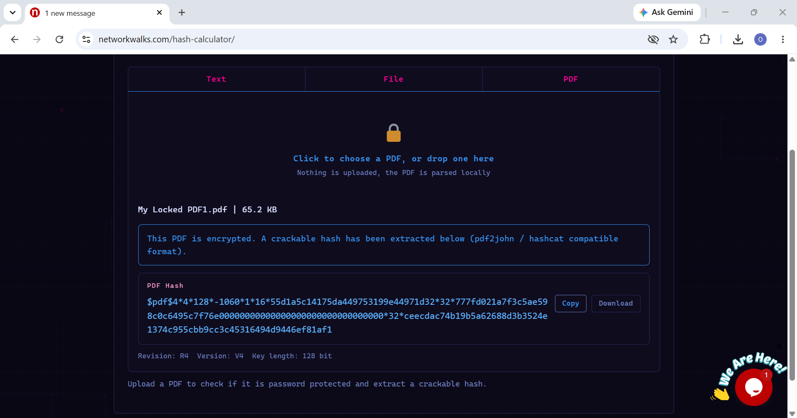

[Generate the PDF Hash](screenshots/part2-hash-calculator2.png)

[Generate the PDF Hash](screenshots/part2-hash-calculator3.png)

---

## Step 3 - Use the Password Cracker

I opened the Networkwalks Password Cracker:

https://networkwalks.com/password-cracker/

I pasted the extracted PDF hash into the tool and started the password-cracking process.

### Screenshot

---

## Step 4 - Recover and Test the Password

The tool attempted different password candidates until it found a matching password.

I then entered the recovered password into the original PDF.

The PDF opened successfully, confirming the result.

### Screenshot

### Screenshot

---

# Part 3 - John the Ripper with AI Assistance

## Objective

The objective of this exercise was to use John the Ripper with AI assistance through Hexstrike-AI MCP and Claude Desktop on Kali Linux.

---

## Lab Environment
Kali Linux
Claude Desktop
Hexstrike-AI MCP
John the Ripper
RockYou wordlist
Password-protected PDF

---

## Step 1 - Prepare the Target File

I copied the provided PDF file to the Kali Linux Desktop:

/home/kali/Desktop/hash3.networkwalks_flag1.pdf
### Screenshot

---

## Step 2 - Verify John the Ripper

I used Claude Desktop with the Hexstrike-AI MCP environment to check whether John the Ripper was installed and to verify its version.

Example prompt:

```text
Check if John the Ripper is installed in this Hexstrike MCP and show me its version.
```

### Screenshot

---

## Step 3 - Calculate the PDF Hash

I asked the AI to calculate the hash of the target PDF.

```text
Please calculate the hash value of this PDF file:

/home/kali/Desktop/hash3.networkwalks_flag1.pdf
```

The resulting PDF hash was then used for the password-cracking process.

### Screenshot

---

## Step 4 - Crack the Password

I instructed the AI to use the JTR tool available through the Hexstrike-AI MCP server and the RockYou wordlist.

```text
Please use JTR tool in this hexstrike MCP server to crack the password of this PDF file.
Use the rockyou.txt wordlist dictionary.
```

John the Ripper then performed the password attack using the specified wordlist.

### Screenshot

---

## Step 5 - Verify the Result

After the password was recovered, I used it to open the protected PDF file.

The PDF opened successfully, confirming that the recovered password was correct.

### Screenshot

### Screenshot

---

## Key Concepts Learned

Through these three exercises, I gained practical experience with:

- PDF password protection
- Hash extraction
- John the Ripper
- Johnny GUI
- Wordlist-based password attacks
- RockYou wordlists
- Password complexity
- AI-assisted security tooling
- Kali Linux security tools
- Verification of recovered passwords

The main lesson from this week's activities was understanding the workflow:

<pre>
┌──────────────────────────────┐
│         Protected PDF        │
└──────────────┬───────────────┘
               │
               ▼
┌──────────────────────────────┐
│       Extract PDF Hash       │
└──────────────┬───────────────┘
               │
               ▼
┌──────────────────────────────┐
│   Select Password-Cracking   │
│            Method            │
└──────────────┬───────────────┘
               │
               ▼
┌──────────────────────────────┐
│      Run Password Attack     │
└──────────────┬───────────────┘
               │
               ▼
┌──────────────────────────────┐
│       Recover Password       │
└──────────────┬───────────────┘
               │
               ▼
┌──────────────────────────────┐
│    Test Password Against PDF │
└──────────────────────────────┘
</pre>

---

# Conclusion

Week 3 gave me hands-on experience with password recovery techniques using both traditional security tools and AI-assisted tooling.

I learned that password cracking is not simply about running a tool. The process involves identifying the correct hash format, selecting an appropriate attack method or wordlist, monitoring the attack, and verifying the recovered password.

All activities were performed against authorized laboratory files for educational purposes.

---

# Tools and Resources
- John the Ripper: https://www.openwall.com/john/
- Johnny: https://openwall.info/wiki/john/johnny
- Networkwalks Hash Calculator: https://networkwalks.com/hash-calculator/
- Networkwalks Password Cracker: https://networkwalks.com/password-cracker/
- Networkwalks Lab: https://networkwalks.com/project-task-lab-password-cracking-with-networkwalks/

---

# Project Information

**Program:** Cybersecurity at Networkwalks

**Batch:** B082

**Week:** 03

**Project:** PDF Password Cracking

**Student:** OKUMBA-MITCHOWANOU EBENISERT-BIENVENU

